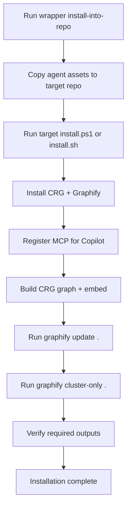
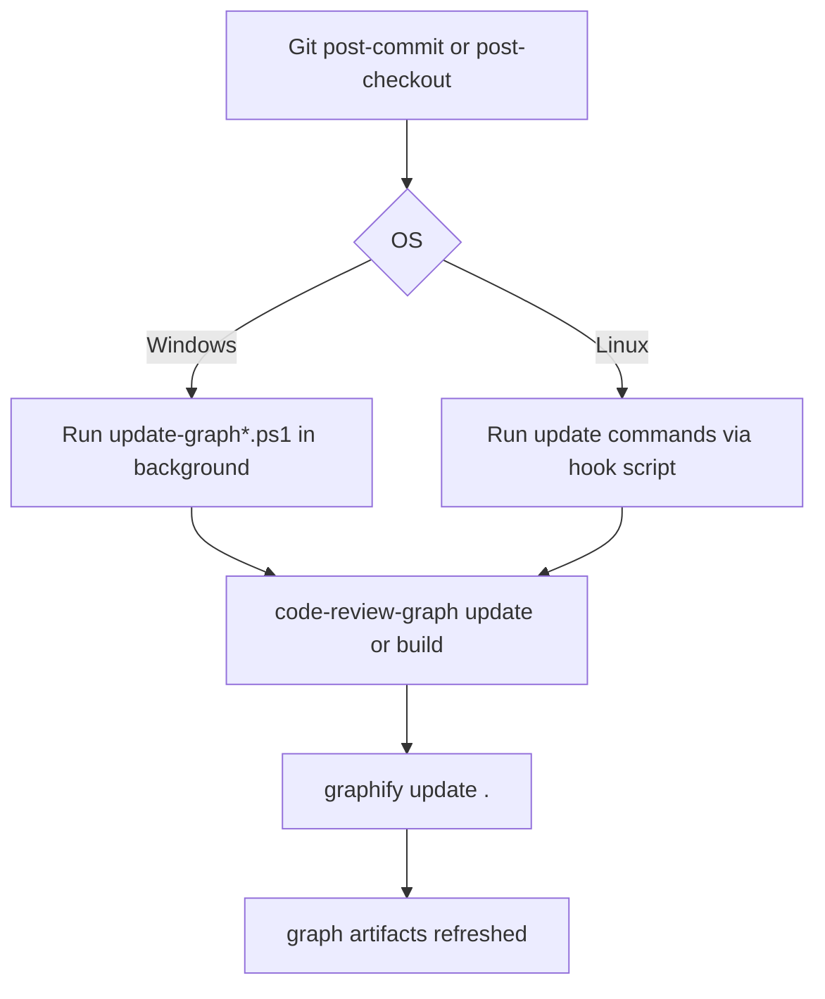

# Operational Workflow

## End-to-end install workflow

## Hook update workflow

## Human consumption outputs

- CRG review wiki: `.code-review-graph/wiki/`
- Graphify structural report: `graphify-out/GRAPH_REPORT.md`
- Graphify interactive graph: `graphify-out/graph.html`

## Recommended operator checklist

1. Run installer in target repo.
2. Confirm wrapper verification passes.
3. Open `.code-review-graph/wiki/` for markdown navigation.
4. Open `graphify-out/graph.html` for interactive graph view.
5. Run a commit and confirm hooks refresh outputs.
