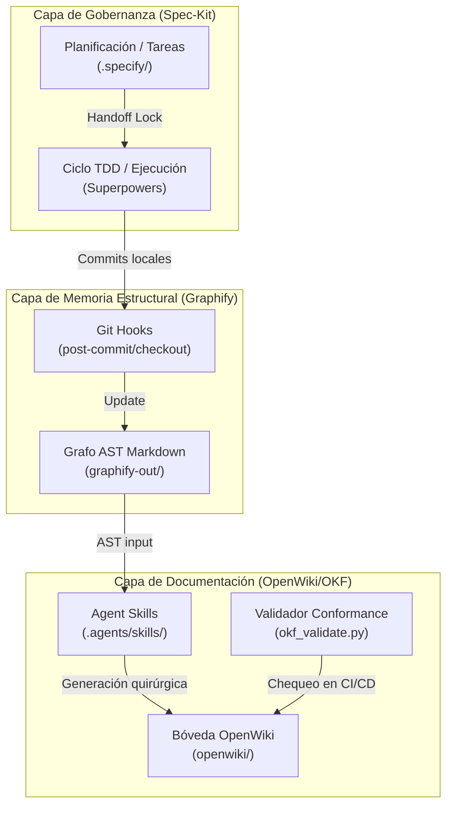

# 📖 Manual de Instalación y Uso: Ecosistema DeepWiki Documenter

Este manual describe detalladamente cómo instalar y utilizar el ecosistema **DeepWiki Documenter** en cualquier proyecto de software (soporta Python, TypeScript/JavaScript, Go, Rust, Java, C/C++, C#) para establecer una **arquitectura agéntica y documental** conforme a los estándares **ISO/IEC/IEEE 42010:2022** y **ISO/IEC/IEEE 15289:2019**.

---

## 🚀 1. Arquitectura General

El ecosistema opera mediante una estructura de **3 capas** para separar gobernanza, ejecución y memoria:



---

## 🛠️ 2. Guía de Instalación Rápida

### Requisitos Previos

Asegúrate de contar con las siguientes herramientas en tu sistema local:
* **Git** instalado.
* **Python 3.10+** (o el gestor `uv` se encargará de descargarlo).
* **Node.js 22+** (solo requerido para el motor de generación en CI/CD).
* **Compilador/Herramientas de tu lenguaje** (ej. `cargo` para Rust, `g++`/`clang` para C/C++, `go` para Go, `npm`/`tsc` para TypeScript). Graphify extraerá la estructura del AST compatible.

### Instalación en un Nuevo Proyecto (Destino)

Para inyectar el ecosistema de documentación desde el repositorio origen `Documentation_agent` en un proyecto de software destino, utiliza los scripts de automatización:

#### En Ubuntu / Linux (Bash)
Ejecuta el script wrapper apuntando a la ruta absoluta de tu repositorio de destino:
```bash
./install-into-repo.sh /ruta/a/tu/proyecto-destino
```

#### En Windows (PowerShell como Administrador)
Abre PowerShell y ejecuta:
```powershell
Set-ExecutionPolicy Bypass -Scope Process -Force
.\install-into-repo.ps1 -TargetRepoPath "C:\ruta\a\tu\proyecto-destino"
```

### ¿Qué hace el instalador por ti?
1. Copia la carpeta de habilidades agénticas `.agents/` con los motores de documentación.
2. Configura los **Git Hooks** en `.git/hooks/` para automatizar la sincronización.
3. Instala localmente `uv` y el motor `graphify`.
4. Genera el primer reporte visual (`graphify-out/`).

---

## 📋 3. Estructura de la Documentación (Estándar OKF)

Una vez completada la instalación, la documentación se estructurará bajo el estándar **Open Knowledge Format (OKF) v0.2** en el directorio `./openwiki/`:

```
tu-repositorio/
├── openwiki/
│   ├── index.md                      # Hub de navegación y mapa máster
│   ├── architecture/
│   │   ├── iso_42010_overview.md     # Index de perspectivas e ISO viewpoints
│   │   ├── system_context.md         # Contexto del sistema y límites
│   │   ├── component_structure.md    # Estructura e interfaces (UML Mermaid)
│   │   └── adr/                      # Registros de decisiones de arquitectura
│   ├── specifications/
│   │   └── api_contracts.md          # Especificaciones técnicas de interfaces y CLI
│   ├── quality/
│   │   └── iso_25010_quality.md      # Evaluación de calidad de software
│   ├── user_guides/
│   │   └── developer_guide.md        # Guía de incorporación para desarrolladores
│   └── logs.md                       # Log de cambios y auditoría incremental
```

---

## ⚙️ 4. Guía de Uso del Desarrollador

El ecosistema funciona de manera **invisible** y **transparente** en tu flujo de trabajo diario:

### A. Sincronización Automática (Git Hooks)
* **Al hacer Commit (`post-commit`):** El Git Hook lanza en segundo plano `graphify update .` y actualiza la base de datos AST local. Esto no interrumpe tu consola y te permite seguir escribiendo código.
* **Al cambiar de Rama (`post-checkout`):** El hook detecta cuántos archivos cambiaron. Si cambiaste más de 5 archivos, realiza una reconstrucción limpia completa del grafo de conocimiento. Si cambiaste menos de 5, realiza una actualización incremental rápida.

### B. Ejecución de Skills en tu IDE (GitHub Copilot / Antigravity)
Cuando desees generar o actualizar la documentación, invoca a tu agente usando las habilidades provistas:

#### 1. Generación de Línea Base (Día 0)
Pide a tu agente en el chat:
> `@workspace Usa el skill okf-professional-documenter en Full Mode para generar la estructura de documentación en openwiki/ basada en el código actual.`

#### 2. Actualización Quirúrgica (Al cambiar código)
Tras realizar cambios locales, indica al agente:
> `@workspace Usa el skill uml2-okf-documenter en Incremental Git Diff Mode para actualizar la documentación de los módulos modificados en mi último commit.`

### C. Soporte Multilenguaje para Extracción AST
El ecosistema adapta la extracción de diagramas de componentes y clases según el lenguaje de tu base de código:
* **Python**: Utiliza `pyreverse -o dot <dir>` para estructurar clases y relaciones.
* **Rust**: Consulta el grafo AST de Graphify o utiliza herramientas como `cargo-modules` para diagramar la jerarquía de crates.
* **C/C++**: Extrae dependencias mediante el dump de AST de `clang` o diagramación de Doxygen compatible con Graphify.
* **Go**: Utiliza `go list -json` o la diagramación de Graphify.
* **TypeScript / JavaScript**: Utiliza `dependency-cruiser` o `ts-morph` en conjunto con Graphify para extraer dependencias.

### D. Ejecución Local del CLI de LangChain OpenWiki (Opcional)
Si deseas refrescar la documentación completa simulando el pipeline de integración continua en tu máquina de desarrollo utilizando la herramienta CLI oficial de LangChain:

1. **Instalación Global**:
   Asegúrate de contar con Node.js 22+ e instala el paquete globalmente:
   ```bash
   npm install -g openwiki
   ```
   *(Opcional: Añade `mermaid` y `jsdom` si deseas validaciones de diagramas de alta fidelidad: `npm install -g openwiki mermaid jsdom`)*

2. **Configuración de Variables de Entorno**:
   Define tus claves y proveedor de LLM en tu consola antes de ejecutar:
   ```bash
   export OPENWIKI_PROVIDER="openrouter"
   export OPENROUTER_API_KEY="tu-api-key-de-openrouter"
   export OPENWIKI_MODEL_ID="z-ai/glm-5.2" # O el modelo asignado por arquitectura
   export OPENWIKI_LANGSMITH_API_KEY="tu-key-de-langsmith" # Requerido para sincronizar conectores
   ```

3. **Ejecución de Sincronización**:
   Corre el comando para actualizar la carpeta `openwiki/` del proyecto:
   ```bash
   openwiki code --update --print
   ```

4. **Conversión de Enlaces (Opcional en local)**:
   Para que los enlaces generados (`[[WikiLinks]]`) y referencias de archivos (`src/...`) sean clickables en tu IDE, corre el convertidor de enlaces:
   ```bash
   python3 skills/validate/scripts/convert_links.py
   ```
   *(Este paso se ejecuta automáticamente en el pipeline de CI/CD para garantizar que los Pull Requests de la wiki contengan únicamente enlaces Markdown estándar clickables).*

---

## 🔒 5. Reglas de Soberanía (No Negociables)

Para evitar colisiones de contexto en flujos agénticos complejos, respeta las fronteras de soberanía:

1. **Spec-Kit manda en la intención:** Los archivos `.specify/`, `specs/`, `plan.md` y `tasks.md` solo se modifican utilizando comandos `/speckit`.
2. **Superpowers manda en la ejecución:** No modifiques código en `src/` o `tests/` sin un archivo de bloqueo activo (`superpowers-handoff.json`).
3. **OpenWiki manda en la documentación:** La carpeta `openwiki/` es el artefacto máster de arquitectura. Todo plan o especificación de Spec-Kit debe contener enlaces directos de referencia cruzada (`[[Concepto]]`) a la Wiki.

---

## 🔍 6. Validación de Conformidad (CI/CD Quality Gates)

El pipeline de CI/CD cuenta con un motor de validación estricto para asegurar que la documentación cumpla con los estándares organizacionales de manera automatizada.

### Separación de Responsabilidades (IDE vs. CI/CD)
* **IDE (Desarrollador/Agente):** Genera documentación ligera y estructurada enfocada únicamente en el estándar **OKF v0.2**. Los archivos markdown contienen metadatos simplificados (`type`, `title`, `description`, `tags`, `timestamp`, `generated`, `verified`, `last_verified_commit`). No es necesario redactar ni gestionar manualmente los campos de cumplimiento ISO.
* **CI/CD Pipeline (Validador):** Al ejecutarse con la bandera `--strict`, el script `okf_validate.py` mapea e infiere automáticamente los viewpoints de **ISO/IEC/IEEE 42010** y tipos de documento de **ISO/IEC/IEEE 15289** según la ruta del archivo y su tipo de concepto OKF. Genera un reporte detallado de cumplimiento normativo y cobertura de arquitectura de forma 100% automatizada.

### Ejecución Local del Validador
Para verificar si tus archivos Markdown cumplen con la estructura OKF e ISO (por inferencia), ejecuta:
```bash
python3 skills/validate/scripts/okf_validate.py ./openwiki --strict
```

El validador inspeccionará:
* **YAML Frontmatter:** Presencia de campos OKF obligatorios (`type`, `title`, `description`, `tags`, `timestamp`) y de procedencia (`generated`, `verified`, `last_verified_commit`).
* **Cumplimiento ISO (Inferencia y Validación):** Mapeo automático a tipos de documentos ISO (Description, Specification, Report, Procedure) y viewpoints ISO (ContextView, ComponentView, SequenceView, DeploymentView, SecurityView, QualityView, ArchitectureDecision, ArchitectureDescription) y reporte de cobertura total.
* **Sintaxis de Mermaid:** Que los diagramas UML no tengan llaves o corchetes abiertos que rompan la renderización.
* **Rutas Absolutas:** Bloqueo de rutas locales absolutas (ej. `/home/user/...`) garantizando la portabilidad del repositorio.
