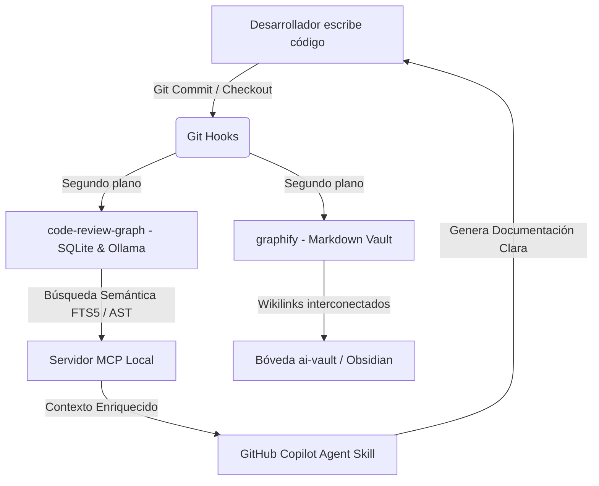

# Ecosistema DeepWiki Documenter (Ubuntu y Windows)

Este repositorio contiene la configuración, scripts de automatización e instrucciones de Agent Skills para habilitar un agente de documentación avanzado en **GitHub Copilot** (u otros asistentes de IA compatibles con el estándar MCP y Agent Skills).

El agente no solo documenta el código fuente, sino que genera y mantiene viva una **"Deep Wiki"** local estructurada mediante grafos de conocimiento y búsquedas semánticas respaldadas por un motor local de embeddings.

---

## 🚀 Arquitectura General



### Componentes Clave:
1. **El Cerebro (`.agentskills/`):** El archivo `SKILL.md` define las directrices y reglas del agente, ordenándole estructurar la documentación como una wiki interconectada mediante Wikilinks (`[[Clase]]`) e identificando el radio de impacto de los cambios.
2. **El Grafo Estructural (`code-review-graph`):** Herramienta que analiza el Árbol de Sintaxis Abstracta (AST) de tu proyecto y lo guarda en una base de datos local SQLite. Expone herramientas MCP al agente para entender dependencias.
3. **El Motor Semántico (`Ollama` & `nomic-embed-text`):** Corre localmente y genera embeddings del código fuente, permitiendo al agente realizar búsquedas conceptuales (ej. buscar dónde se procesan pagos sin depender de nombres exactos de funciones).
4. **La Deep Wiki (`graphify`):** Convierte el grafo en ficheros Markdown individuales dentro de la carpeta `./ai-vault/`. Puedes abrir esta carpeta en **Obsidian** para ver un mapa gráfico y navegable de toda tu arquitectura de software.
5. **Los Automatizadores (`hooks/`):** Git Hooks (`post-commit` y `post-checkout`) que ejecutan de forma invisible y paralela las actualizaciones de la base de datos y la wiki al programar, asegurando que el agente nunca trabaje con información obsoleta.

---

## 🛠️ Requisitos Previos

- **Git** instalado.
- **Python** (versión 3.10 o superior) - Opcional si se utiliza `uv` como gestor de paquetes.
- **uv** (Administrador de paquetes de Python ultra rápido. Si no lo tienes, los instaladores lo configurarán por ti).
- **Ollama** (Para búsquedas semánticas locales de embeddings).

---

## 💻 Instalación y Configuración

El repositorio cuenta con instaladores inteligentes específicos para cada sistema operativo que configuran todo el entorno de forma automática:

### En Windows (PowerShell)
Abre una consola de **PowerShell como Administrador** en la raíz del repositorio y ejecuta:

```powershell
Set-ExecutionPolicy Bypass -Scope Process -Force
.\install.ps1
```

### En Ubuntu / Linux (Bash)
Abre tu terminal en la raíz del repositorio y ejecuta:

```bash
chmod +x install.sh
./install.sh
```

*(Nota: En Linux, después de que finalice la instalación, recuerda ejecutar `source ~/.bashrc` o `source ~/.zshrc` según el shell que utilices).*

### Instalación automática en otro repositorio (recomendada para GitHub Copilot Agent)

Si quieres instalar este agente en un repositorio destino, usa los scripts wrapper para evitar errores por pasos manuales.

Windows (PowerShell):

```powershell
Set-ExecutionPolicy Bypass -Scope Process -Force
.\install-into-repo.ps1 "C:\ruta\al\repositorio\destino"
```

Linux/macOS (Bash):

```bash
chmod +x install-into-repo.sh
./install-into-repo.sh /ruta/al/repositorio/destino
```

Estos scripts:
- Copian automáticamente `.agentskills`, `hooks`, `.graphifyignore`, `.code-review-graphignore` e instalador.
- Ejecutan el instalador dentro del repositorio destino.
- Reducen errores por rutas, copias parciales o prompts interactivos.

### Mejoras de robustez del instalador

Los instaladores (`install.ps1` y `install.sh`) están preparados para evitar errores comunes:

- Ejecutan `code-review-graph install -y --platform copilot --no-skills --no-hooks --no-instructions` para evitar prompts y archivos extra.
- Instalan configuración solo para GitHub Copilot (`--platform copilot`) para evitar archivos de otras plataformas.
- No realizan copias del archivo sobre sí mismo para `.graphifyignore` y `.code-review-graphignore`.
- Generan embeddings usando `uvx --from "code-review-graph[embeddings]" code-review-graph embed`, evitando el error por falta de `sentence-transformers`.
- Sincronizan `graphify` antes del `update` para minimizar avisos de desajuste de versión.

---

## 🔄 ¿Cómo Funciona la Sincronización?

La sincronización se realiza de manera 100% transparente para el desarrollador a través de los **Git Hooks**:

- **Al hacer Commit (`post-commit`):** Se ejecuta una actualización incremental ultra rápida del grafo y de los archivos Markdown de la wiki. El desarrollador puede seguir programando inmediatamente sin esperas.
- **Al cambiar de Rama (`post-checkout`):** El hook analiza cuántos archivos cambiaron entre ramas. Si son pocos (<= 5), actualiza incrementalmente; si es un cambio grande (> 5), realiza una reconstrucción limpia completa en segundo plano.

---

## 📂 Trabajo en Equipo y `.gitignore`

Por diseño y mejores prácticas del equipo, los siguientes elementos están añadidos al archivo `.gitignore`:
- **Las bases de datos SQLite (`*.db`):** Contienen rutas absolutas locales del sistema del desarrollador e índices locales de Ollama.
- **La carpeta de salida (`/ai-vault/`):** Al ser autogenerada tras cada commit, subirla al repositorio crearía constantes conflictos de mezcla (merge conflicts) y ensuciaría el historial de Git.

Cada desarrollador que clone el repositorio simplemente ejecuta el instalador una sola vez (`install.ps1` o `install.sh`) para compilar su propia base de datos y wiki local en segundos.

---

## 📊 Visualización de la Wiki en Obsidian

Para navegar visualmente por la arquitectura del proyecto:
1. Descarga e instala [Obsidian](https://obsidian.md/).
2. Selecciona **"Open folder as vault"** (Abrir carpeta como bóveda).
3. Selecciona el directorio `ai-vault` que se ha generado en la raíz de tu proyecto.
4. Presiona `Ctrl + G` (o `Cmd + G` en macOS) para ver el **Grafo Interconectado** del proyecto en tiempo real.


## references 

• [Graphify](https://dev.to/mir_mursalin_ankur/graphify-code-review-graph-build-a-self-updating-knowledge-graph-for-claude-code-and-other-ai-j1m) (mir_mursalin_ankur): Construye un gráfico de conocimiento auto-actualizable del repositorio (AST y dependencias) para evitar que la IA realice búsquedas ciegas (grep o glob), reduciendo drásticamente la saturación de tokens y el context drift.