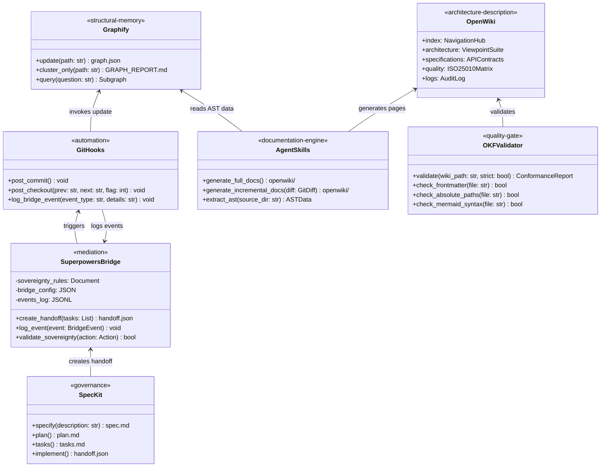

# Component Structure View: Documentation_agent Ecosystem

## 1. Subsystem Decomposition

The Documentation_agent ecosystem is organized into five logical subsystems:

```mermaid
flowchart TD
    subgraph "Layer 1: Governance"
        SK["Spec-Kit<br/>(.specify/)"]
        SP["Superpowers<br/>(Bridge)"]
        BR["Bridge<br/>(.specify/bridge/)"]
    end

    subgraph "Layer 2: Structural Memory"
    subgraph "Layer 2: Structural Memory"
        GR["Graphify<br/>(graphify-out/)"]
        HK["Git Hooks<br/>(hooks/)"]
    end

    subgraph "Layer 3: Documentation Engine"
        OW["OpenWiki<br/>(openwiki/)"]
        AS["Agent Skills<br/>(.agents/skills/)"]
        VL["OKF Validator<br/>(skills/validate/)"]
    end

    subgraph "Layer 4: CI/CD"
        GA["GitHub Actions<br/>(.github/workflows/)"]
        IN["Installers<br/>(install.sh, install.ps1)"]
    end

    SK --> BR
    SP --> BR
    BR --> HK
    HK --> GR
    GR --> AS
    AS --> OW
    VL --> OW
    GA --> VL
    GA --> OW
```

## 2. Component Inventory

### 2.1 Governance Components

| Component | Location | Responsibility |
|:---|:---|:---|
| **Spec-Kit Engine** | `.specify/` | Specification lifecycle management (constitution, specs, plans, tasks) |
| **Spec-Kit Templates** | `.specify/templates/` | Canonical templates for spec, plan, tasks, checklist, constitution |
| **Spec-Kit Agents** | `.github/agents/` | Agent definitions for Spec-Kit workflows (10 agents) |
| **Spec-Kit Prompts** | `.github/prompts/` | IDE prompt files for Spec-Kit command invocations |
| **Superpowers Bridge** | `.specify/bridge/` | Sovereignty mediation, state transitions, event logging |
| **Constitution** | `.specify/memory/constitution.md` | Project governance principles |

### 2.2 Structural Memory Components

| Component | Location | Responsibility |
|:---|:---|:---|
| **Graphify AST Graph** | `graphify-out/` (generated) | AST dependency graph, community detection, knowledge wiki |
| **Post-Commit Hook** | `hooks/post-commit` | Cross-platform hook triggering background graph updates |
| **Post-Checkout Hook** | `hooks/post-checkout` | Incremental/full rebuild on branch switch |
| **Bridge Event Logger** | `hooks/log-bridge-event.sh` | Structured event logging for ISO 15289 traceability |

### 2.3 Documentation Engine Components

| Component | Location | Responsibility |
|:---|:---|:---|
| **OpenWiki Bundle** | `openwiki/` | ISO 42010 Architecture Description artifact (OKF v0.2) |
| **OKF Professional Documenter** | `.agents/skills/okf-professional-documenter/` | Agent skill for ISO-compliant OKF documentation |
| **UML2 OKF Documenter** | `.agents/skills/uml2-okf-documenter/` | Agent skill for full/incremental ISO documentation with UML 2.0 |
| **OKF Validator** | `skills/validate/scripts/okf_validate.py` | CI/CD conformance checker for OKF frontmatter and structure |

### 2.4 CI/CD Components

| Component | Location | Responsibility |
|:---|:---|:---|
| **Validate Docs Workflow** | `.github/workflows/validate-docs.yml` | OKF conformance validation on push/PR |
| **OpenWiki Update Workflow** | `.github/workflows/openwiki-update.yml` | Scheduled/manual OpenWiki regeneration via LLM |
| **Install Script (Linux)** | `install.sh` | Automated environment setup (uv, Graphify, hooks) |
| **Install Script (Windows)** | `install.ps1` | PowerShell equivalent of Linux installer |
| **Install-into-Repo Wrappers** | `install-into-repo.sh`, `install-into-repo.ps1` | Deploy ecosystem into target repositories |

## 3. UML 2.0 Component Diagram


