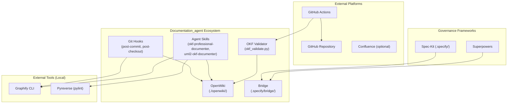
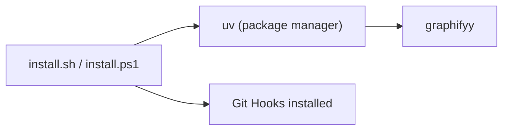
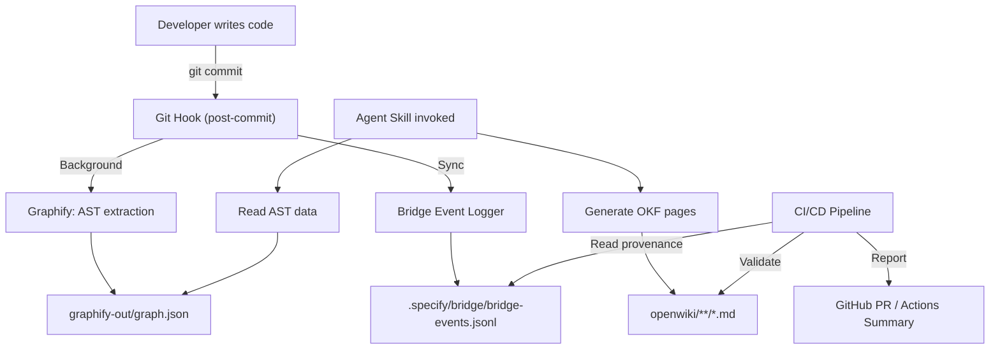

# Context View: Documentation_agent Ecosystem

## 1. System Boundary Definition

The Documentation_agent ecosystem is a **local-first developer tooling platform** that automates the generation and maintenance of ISO-compliant software documentation. It runs entirely on the developer's machine, with optional CI/CD extensions via GitHub Actions.

## 2. External Actor Interactions

| External Actor | Interaction Type | Protocol / Interface | Data Exchanged |
|:---|:---|:---|:---|
| **Graphify CLI** | CLI execution | `graphify update .` / `graphify cluster-only .` | `graphify-out/graph.json`, `GRAPH_REPORT.md`, `graph.html` |
| **Pyreverse** | CLI execution | `pyreverse -o dot <dir>` | DOT graph output for class hierarchies |
| **GitHub Actions** | CI/CD trigger | `on: [push, pull_request]` / `schedule` | OKF validation results, OpenWiki update PRs |
| **Spec-Kit** | IDE agent workflow | `/speckit.specify`, `/speckit.plan`, `/speckit.tasks` | `spec.md`, `plan.md`, `tasks.md` |
| **Superpowers** | IDE agent execution | TDD cycles via bridge handoff | Test results, code mutations |

## 3. Installation Dependencies

### Dependency Matrix

| Dependency | Required? | Purpose | Install Method |
|:---|:---|:---|:---|
| `uv` | Yes | Python package management | `curl -LsSf https://astral.sh/uv/install.sh \| sh` |
| `graphify` / `graphifyy` | Yes | AST graph + community detection | `uv tool install graphifyy` |
| `pylint` (pyreverse) | Recommended | Class hierarchy extraction | `pip install pylint` |
| `Node.js 22+` | CI/CD only | OpenWiki GitHub Action | GitHub Actions `setup-node` |

## 4. Data Flow Overview

