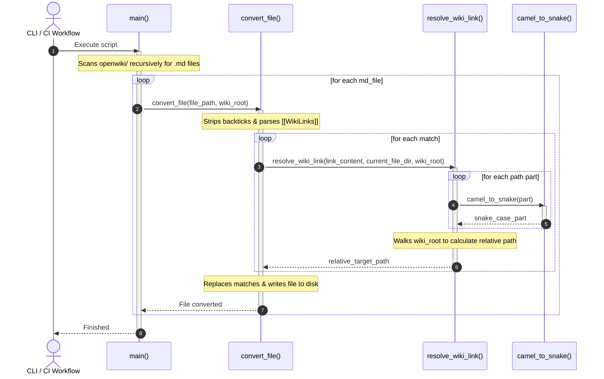

# Module Specification: convert_links

* **Source Reference:** [skills/validate/scripts/convert_links.py](../../../../../skills/validate/scripts/convert_links.py) (Lines: L1-L164)

## 1. Architectural Role & Responsibilities

The `convert_links` module is a utility script that automates the migration of legacy wiki Obsidian-style double-bracket wikilinks (`[[WikiLink]]`) into standard relative Markdown links (`[label](relative_path.md)`). This is used during automated documentation publishing pipelines to guarantee cross-platform and static host compatibility.

## 2. UML 2.0 Execution Flow (Sequence Diagram)

## 3. Function Specifications

### `camel_to_snake(name)` (L6-14)
- **Purpose:** Converts a CamelCase string to snake_case. Handles special cases like `init` -> `__init__` and `main` -> `__main__`.
- **Inputs:**
  - `name` (`str`): The string to convert.
- **Outputs:**
  - `str`: The converted snake_case string.

### `resolve_wiki_link(link_content, current_file_dir, wiki_root)` (L16-42)
- **Purpose:** Resolves a wikilink string into a relative file path from the source file. Normalizes folder names to snake_case and verifies file existence.
- **Inputs:**
  - `link_content` (`str`): The wikilink path reference.
  - `current_file_dir` (`str`): Directory containing the file being parsed.
  - `wiki_root` (`str`): Absolute path to the root directory of the wiki.
- **Outputs:**
  - `str | None`: The relative path to the target markdown file if found, otherwise `None`.

### `convert_file(file_path, wiki_root)` (L44-149)
- **Purpose:** Opens a markdown file, parses it for wikilinks and source code path citations, transforms them into standardized relative links, and saves changes.
- **Inputs:**
  - `file_path` (`str`): Path to the target markdown file.
  - `wiki_root` (`str`): Absolute path to the root of the wiki.
- **Outputs:**
  - `None`.

### `main()` (L150-160)
- **Purpose:** Scans the `openwiki/` folder recursively and processes all markdown files through `convert_file()`.
- **Inputs:** None.
- **Outputs:** None.
