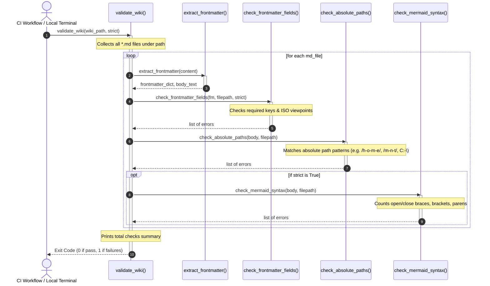

# Module Specification: okf_validate

* **Source Reference:** [skills/validate/scripts/okf_validate.py](../../../../../skills/validate/scripts/okf_validate.py) (Lines: L1-L364)

## 1. Architectural Role & Responsibilities

The `okf_validate` module acts as a Quality Gate in the documentation publishing pipeline. It performs strict validation of all markdown documentation files to ensure they conform to the OKF v0.2 frontmatter format, enforce relative path rules (preventing leakage of local workspace absolute paths), and verify structural balance of Mermaid.js diagrams.

## 2. UML 2.0 Execution Flow (Sequence Diagram)

## 3. Function Specifications

### `_parse_yaml(text)` (L29-49)
- **Purpose:** Safely loads YAML metadata. Tries to use PyYAML first, falling back to a lightweight key-value text parser if PyYAML is not installed.
- **Inputs:**
  - `text` (`str`): YAML block string.
- **Outputs:**
  - `dict[str, Any]`: Dictionary representing the frontmatter properties.

### `extract_frontmatter(content)` (L76-85)
- **Purpose:** Splits the YAML frontmatter block (enclosed in `---`) from the rest of the Markdown page body.
- **Inputs:**
  - `content` (`str`): The raw file content.
- **Outputs:**
  - `tuple[dict[str, Any], str]`: Separated frontmatter dict and body text.

### `infer_iso_metadata(filepath, fm)` (L88-148)
- **Purpose:** Infers the `iso_doc_type` and `iso_viewpoint` from the file's path and OKF concept `type` attribute, overriding them with explicit frontmatter values if present.
- **Inputs:**
  - `filepath` (`str`): Path to the current file.
  - `fm` (`dict[str, Any]`): Parsed frontmatter.
- **Outputs:**
  - `tuple[str, str]`: Mapped (inferred or explicit) `(iso_doc_type, iso_viewpoint)`.

### `check_frontmatter_fields(fm, filepath, strict)` (L150-186)
- **Purpose:** Verifies that all required fields (`type`, `title`, `description`, `tags`, `timestamp`) exist in the frontmatter. Under strict mode, validates `generated`, `verified`, `last_verified_commit`, and confirms that the (explicit or inferred) ISO viewpoints and doc types comply with standard values.
- **Inputs:**
  - `fm` (`dict[str, Any]`): Parsed frontmatter.
  - `filepath` (`str`): Path to the current file.
  - `strict` (`bool`): Toggle strict validation.
- **Outputs:**
  - `tuple[list[str], str, str]`: Conformance error list, and final mapped `(iso_doc_type, iso_viewpoint)`.

### `check_absolute_paths(body, filepath)` (L188-198)
- **Purpose:** Scans the document body line-by-line using a regex pattern to detect absolute paths, forcing relative references.
- **Inputs:**
  - `body` (`str`): Markdown body.
  - `filepath` (`str`): File path.
- **Outputs:**
  - `list[str]`: List of leakage error strings.

### `check_mermaid_syntax(body, filepath)` (L200-262)
- **Purpose:** Basic syntactic check of Mermaid diagrams inside markdown blocks. Asserts balanced braces `{}`, brackets `[]`, and parentheses `()`.
- **Inputs:**
  - `body` (`str`): Markdown body.
  - `filepath` (`str`): File path.
- **Outputs:**
  - `list[str]`: List of unbalanced syntax error strings.

### `validate_wiki(wiki_path, strict)` (L264-362)
- **Purpose:** Aggregates checks for all markdown files under `wiki_path`, logs errors to standard output, maps documents to ISO standards, performs coverage analysis, and returns the total error count.
- **Inputs:**
  - `wiki_path` (`str`): Root folder of the wiki.
  - `strict` (`bool`): Toggle strict checks.
- **Outputs:**
  - `int`: Number of validation errors.
