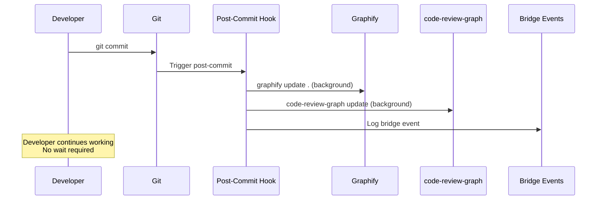

# Developer Guide: Documentation_agent Ecosystem

## 1. Quick Start

### Prerequisites

- **Git** installed and configured
- **Python 3.10+** (or `uv` will manage it)
- **Internet access** (for first-time tool installation)

### Installation (One Command)

**Linux/macOS:**
```bash
chmod +x install.sh
./install.sh
source ~/.bashrc  # Apply environment changes
```

**Windows (PowerShell as Administrator):**
```powershell
Set-ExecutionPolicy Bypass -Scope Process -Force
.\install.ps1
```

### What Gets Installed

1. `uv` — Python package manager
2. `code-review-graph` — AST graph database + MCP server
3. `graphify` — Knowledge graph with community detection
4. `Ollama` + `nomic-embed-text` — Local semantic embeddings (optional)
5. **Git Hooks** — Automated graph updates on every commit/checkout

## 2. How It Works

After installation, the ecosystem runs **transparently** in the background:



## 3. Agent Skills Usage

### Generating Full Documentation

When your IDE agent (Copilot, Antigravity, etc.) is active, invoke the documentation skill:

```
Use the uml2-okf-documenter skill in Full Documentation Mode to generate 
complete architecture documentation for this project.
```

### Updating Documentation After Changes

```
Use the uml2-okf-documenter skill in Incremental Git Diff Mode to update 
documentation for the recent code changes.
```

### Using Spec-Kit Governance

```
/speckit.specify "Add semantic search capability to the documentation agent"
/speckit.plan
/speckit.tasks
/speckit.implement  # Creates bridge handoff to Superpowers
```

## 4. Sovereignty Rules

> **CRITICAL:** Understand the sovereignty boundaries before making changes.

| Domain | Owner | You May Modify |
|:---|:---|:---|
| Specifications | Spec-Kit | Only via `/speckit.*` commands |
| Code Execution | Superpowers | Only with active `superpowers-handoff.json` |
| Documentation | OpenWiki/OKF | Via agent skills or manual editing |
| Graph Data | Git Hooks | **Never modify manually** — auto-generated |

See [Sovereignty Rules](file:///.specify/bridge/sovereignty-rules.md) for the full contract.

## 5. Project Structure

```
Documentation_agent/
├── .agents/skills/              # Agent skills (canonical location)
│   ├── okf-professional-documenter/
│   └── uml2-okf-documenter/
├── .specify/                    # Spec-Kit governance
│   ├── bridge/                  # Sovereignty bridge
│   ├── memory/                  # Constitution
│   ├── templates/               # Spec/plan/tasks templates
│   └── workflows/               # Spec-Kit workflows
├── .github/
│   ├── agents/                  # Spec-Kit agent definitions
│   ├── copilot-instructions.md  # IDE agent rules + sovereignty
│   ├── prompts/                 # Spec-Kit prompt files
│   └── workflows/               # CI/CD pipelines
├── hooks/                       # Git hooks (source of truth)
├── openwiki/                    # ISO 42010 Architecture Description
│   ├── architecture/            # Viewpoint suite
│   ├── specifications/          # API contracts
│   ├── quality/                 # ISO 25010 assessment
│   ├── user_guides/             # THIS GUIDE
│   ├── index.md                 # Navigation hub
│   └── logs.md                  # Audit log
├── skills/validate/             # OKF validator
├── install.sh                   # Linux installer
├── install.ps1                  # Windows installer
└── README.md                    # Project overview
```

## 6. Troubleshooting

### Graphify not found after installation

```bash
export PATH="$HOME/.local/bin:$PATH"
source ~/.bashrc
```

### Package naming: `graphify` vs `graphifyy`

Some environments expose the package as `graphifyy` while the CLI command remains `graphify`. The installer handles this automatically with fallback logic.

### Hooks not firing

1. Verify hooks are installed: `ls -la .git/hooks/post-commit`
2. Verify execution permissions: `chmod +x .git/hooks/post-commit`
3. Re-install hooks: `cp hooks/* .git/hooks/ && chmod +x .git/hooks/post-*`

### Graph data seems stale

Force a full rebuild:
```bash
code-review-graph build
graphify update .
graphify cluster-only .
```
